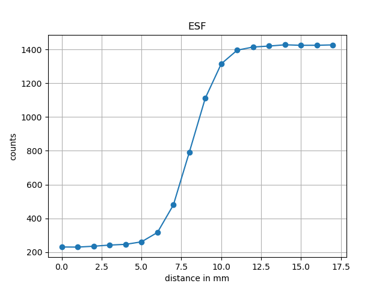
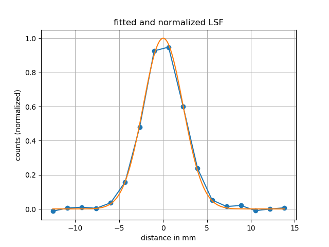
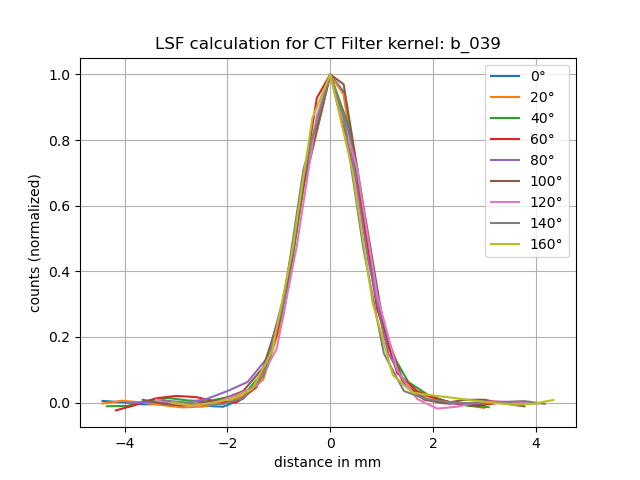

# CT Data Processing Project

## Overview

This project consists of 3 modules.

The modules **Artificial_Data_Generation** and **Artificial_Data_Evaluation** were used for data generation and analysis for the paper **Frensch C, Bäcker CM, Jentzen W, et al. Dose distributions of proton therapy plans are robust against lowering the resolution of CTs combined with increasing noise. Med Phys. 2025; 52:1293–1304.** (https://doi.org/10.1002/mp.17530).

The **Experiment_Evaluation** module offers two different analysis possibilities:

1. **PET/CT Reconstruction Analysis**: Investigation of spatial resolution of artificial CTs generated from PET/CT data. The datasets are designated as FDG_1 to FDG_30 and GA_1 to GA_30, where FDG and GA stand for the administered radionuclides and the number indicates the number of reconstruction iterations of the algorithm. MTF10/MTF50 values as well as FWHM parameters are determined from the data to characterize spatial resolution.

2. **Phantom-based Spatial Resolution Analysis**: Evaluation of CT data measured using the spatial resolution module of a phantom. Here, Line Spread Function (LSF) parameters are determined and visualized.

**Note:** Due to the size of medical CT datasets (typically several GB per patient) and data protection regulations, no example data is included in this repository. Specific experimental data can be provided upon request for research purposes.

## Modules

### Artificial_Data_Generation
The core module for generating synthetic CT data. Implements various degradation procedures for simulating different image qualities:
The Input is the original CT data and after adding noise or filtering, the images can be saved as DICOM or PNG.

**Main Components:**
- **CTData.py**: Core classes for 3D CT data processing
  - `CT3D`: Manages 3D CT volumes from multiple layers
  - `CTLayer`: Represents individual CT slices with DICOM metadata
- **Filter.py**: Spatial filtering operations
  - Gaussian, rectangle and triangle filters for resolution reduction
- **Patient.py**: Patient data management
  - `Patient`: Individual patients with CT scans
  - `PatientDataBase`: Management of multiple patients
- **main_generation.py**: Main processing logic with various modes

**Supported Operations:**
- Spatial filtering (Gaussian, Rectangle, Triangle)
- Noise addition (Gaussian White Noise)
- Combined processing (Filter + Noise)
- Export as DICOM and PNG

### Artificial_Data_Evaluation
Module for quantitative evaluation of artificially generated CT data through gamma analysis and dosimetric evaluation. Implements medical quality assurance metrics for validation of synthetic datasets.
Here there are two dose arrays as input needed for the comparison of the two dose distribution. One distribution of the original CT data and one of the modified CT data. You get these through dose calculation in an dose calculation program such as RayStation.

**Main Functions:**
- Gamma analysis for dosimetric comparisons
- ROI-based evaluations with anatomical structures
- Multi-plane visualization (transversal, sagittal, coronal)
- Statistical evaluation (pass rates, mean gamma, threshold analyses)

### Experiment_Evaluation
Comprehensive module for quantitative image quality analysis of medical imaging data. Implements standardized metrics for evaluating image sharpness, noise, and frequency response characteristics.
Here the experimental data of the PET/CT imaging and the CT resolution imaging is evaluated. The experiment data must be provided as input.

**Main Functions:**
- MTF analysis (Modulation Transfer Function) for resolution evaluation
- ESF/LSF analysis (Edge/Line Spread Function) for sharpness measurement
- FWHM determination (Full Width at Half Maximum)
- Quantitative noise analysis in various ROIs

### Example Outputs of the Experiment_Evaluation Module

The module generates various visualizations of analysis results:

Here is an example of the LSF determined by the ESF from the experiment:

**Edge Spread Function (ESF) Analysis:**



*The extracted Edge Spread Function from the experiment*

**Line Spread Function (LSF) Analysis:**



*Fitted and normalized Line Spread Function with Gaussian fitting*

Here an example of an LSF analysis from CT data generated by scanning an resolution module of a phantom.
Different angles were used to extract the LSF.

**Radial CT Filter Analysis:**



*LSF calculation for CT filter across various angles (0° to 160°) for dataset b_039*

## Data Requirements

### Input Data
The system expects DICOM-formatted CT scans with the following structure:
```
input_data/
├── patient_001/
│   ├── CT001.dcm
│   ├── CT002.dcm
│   └── ...
└── patient_002/
    ├── CT001.dcm
    └── ...
```

### Data Format Specifications
- **Format**: DICOM (.dcm)
- **Modality**: CT (Computed Tomography)
- **Metadata**: Pixel Spacing, Slice Thickness, Rescale Slope/Intercept
- **Image Depth**: 16-bit (uint16)
- **Coordinate System**: Standard DICOM Patient coordinates

### Using Your Own Data
1. Organize DICOM files in patient folders
2. Ensure all required DICOM tags are present
3. Adjust paths in configuration accordingly


## Usage

### Basic Configuration for the module Artifical_Data_Generation

```python
# Verarbeitungsmodus wählen
MODE = 'combined'  # 'spatial', 'noise', 'combined'

# Pfade definieren
DATA_PATH_IN = "../data/input_data"
DATA_PATH_OUT = "../data/output_data"

# Filter-Einstellungen
FILTER_TYPE = 'gaussian'  # 'gaussian', 'rectangle', 'triangle'
```
### Batch Processing

```python
# Alle Patienten verarbeiten
gen = data_base.patient_generator()
widths = [4, 10]
noise_levels = [7.51, 20.55]

for patient in gen:
    for width in widths:
        for noise in noise_levels:
            patient.convolve_with_filter(width=width, filter_type='gaussian')
            patient.add_noise(noise)
            patient.write_modified_as_dicom(data_path=output_path, mods='combined')
```

## Processing Modes

### Data Generation Modes

#### Spatial Filtering (`MODE = 'spatial'`)
- Applies only spatial filters
- Simulates different resolution levels
- Parameters: Filter type and width in mm

#### Noise Addition (`MODE = 'noise'`)
- Adds only Gaussian White Noise
- Simulates different noise levels
- Parameters: Standard deviation in HU

#### Combined Processing (`MODE = 'combined'`)
- Combines spatial filtering with noise addition
- Realistic simulation of degraded image quality
- Parameters: Filter width and noise sigma

### Data Evaluation
- **Gamma Analysis**: Dosimetric comparisons with pass rate evaluation
- **ROI Evaluation**: Anatomy-specific evaluations
- **Visualization**: Multi-plane heatmap overlays

## Data Structure

```
project/
├── Artificial_Data_Generation/
│   ├── CTData.py           # Core CT data classes
│   ├── Filter.py           # Filter operations
│   ├── Patient.py          # Patient management
│   └── main_generation.py  # Main processing
├── Experiment_Evaluation/
│   ├── main_experiment_evaluation.py # Image quality analysis main application
│   ├── image_processing.py # ESF/LSF/MTF analysis
│   ├── noise_analysis.py  # Noise evaluation
│   ├── calculation_utils.py # Mathematical helper functions
│   ├── Lookup_Data.py     # Experiment parameters
│   ├── constants.py       # System constants
│   ├── outputImages/      # Example images of analyses
│   └── Experimente/           # Experiment data for evaluation
├── Artificial_Data_Evaluation/
│   ├── main_evaluation.py # Gamma analysis main application
│   ├── patient_evaluation.py # Dosimetric evaluation
│   ├── evaluation_utils.py # Helper functions and constants
│   └── Dicts.py           # Data structures (not shown)
└── data/
    ├── input_data/         # Original DICOM files
    ├── output_data/        # Processed data
    ├── gauss/             # Gaussian-filtered data
    ├── rect/              # Rectangle-filtered data
    ├── noise/             # Noise added data
    ├── gauss_noise/       # Combined data (noise and filtering)
    └── gamma_overlay/     # Gamma visualizations

 
```


## Technical Details

### Filter Parameters
- **Gaussian**: Sigma values in mm (e.g. 4, 10) (width = 2 sigma)
- **Rectangle**: Width in mm (e.g. 8, 20) (width = half of rectangle width)
- **Triangle**: Width in mm

### Noise Parameters
- Standard deviation in Hounsfield Units (HU)
- Typical values: 4 - 40 HU

### Export Formats
- **DICOM**: Preserves medical metadata
- **PNG**: For visualization with windowing


## Contact

For questions about the code, provision of specific experimental data please contact:

carla.frensch@web.de
